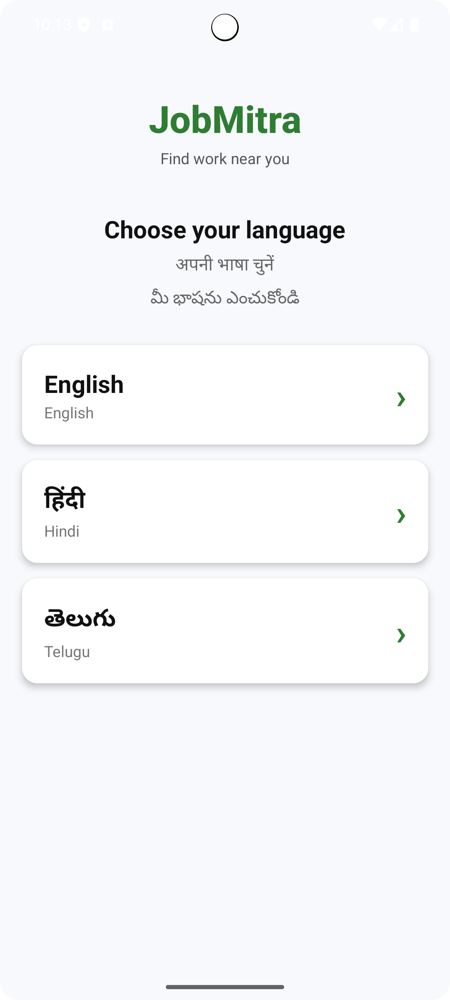
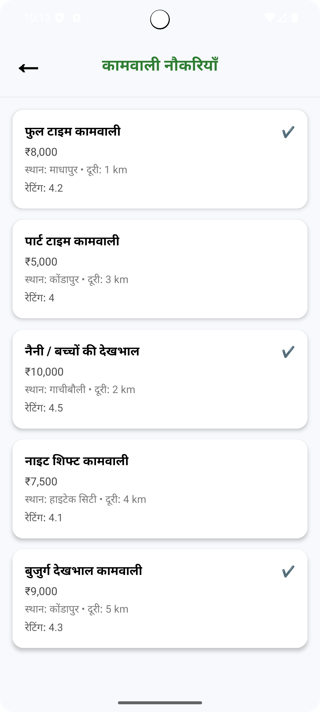
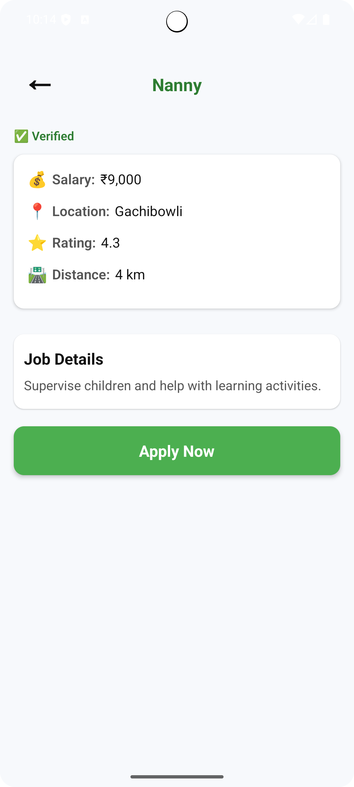
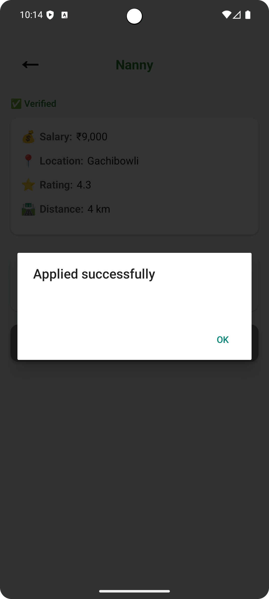

📱 Naukri Blue-Collar Mobile Application (React Native)
🔍 Overview

This is a blue-collar job search mobile application built using React Native.
The app is designed to help blue-collar workers find job opportunities easily and allow employers to post and manage job listings.

The application focuses on simple UI, fast performance, and scalable state management using Zustand.

## Tech Stack

React Native

Zustand (state management)

JavaScript / TypeScript

React Navigation

## Installation

git clone https://github.com/your-username/naukri-bluecollar-mobile.git
cd naukri-bluecollar-mobile
npm install

## Run the App
npx react-native run-android

## Screenshots

=======
# Blue_collar_Mobile
App is designed to help blue-collar workers find job opportunities
>>>>>>> ab8467c3841bfa5cb90b68e5d1d622391fdd114b
